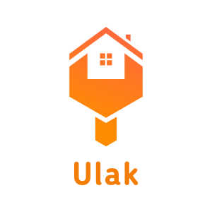
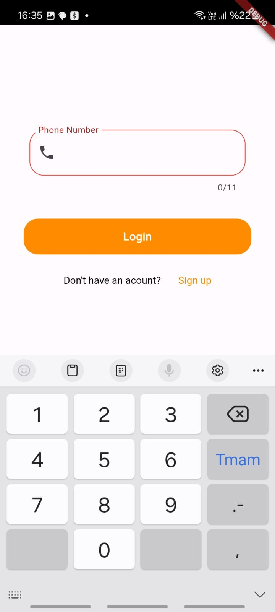
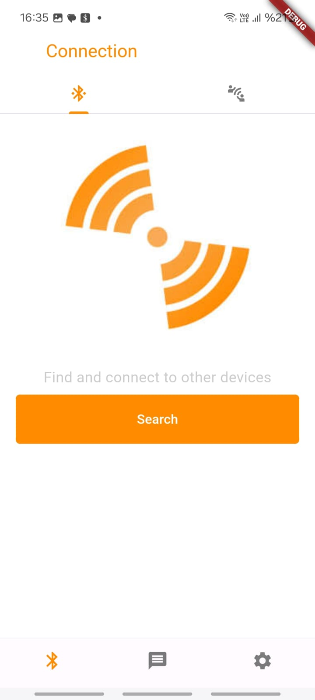
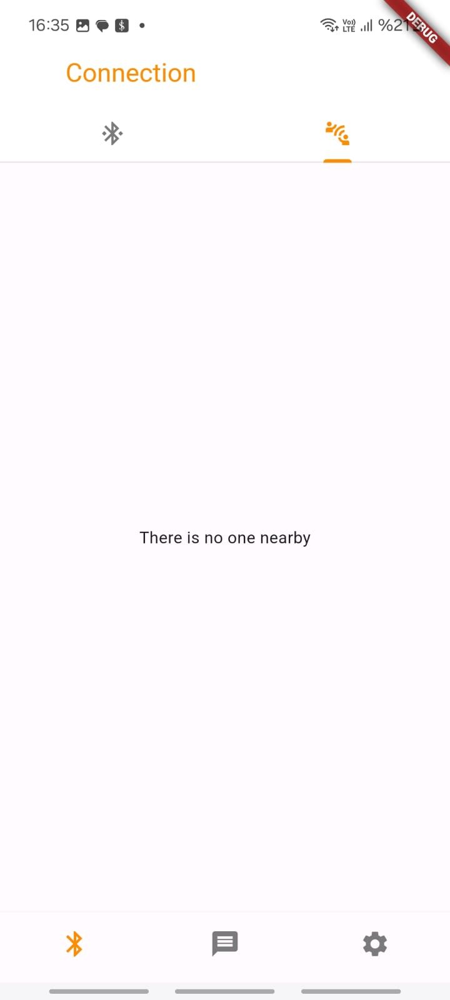
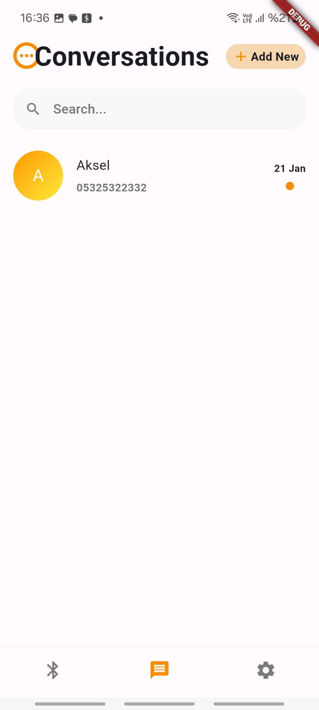

<!-- Improved compatibility of back to top link: See: https://github.com/othneildrew/Best-README-Template/pull/73 -->
<a name="readme-top"></a>
<!--
*** Thanks for checking out the Best-README-Template. If you have a suggestion
*** that would make this better, please fork the repo and create a pull request
*** or simply open an issue with the tag "enhancement".
*** Don't forget to give the project a star!
*** Thanks again! Now go create something AMAZING! :D
-->


<!-- PROJECT SHIELDS -->
<!--
*** I'm using markdown "reference style" links for readability.
*** Reference links are enclosed in brackets [ ] instead of parentheses ( ).
*** See the bottom of this document for the declaration of the reference variables
*** for contributors-url, forks-url, etc. This is an optional, concise syntax you may use.
*** https://www.markdownguide.org/basic-syntax/#reference-style-links
-->
[![Contributors][contributors-shield]][contributors-url]

[![MIT License][license-shield]][license-url]


<!-- PROJECT LOGO -->
<br />
<div align="center">
  <a href="https://github.com/ibasardemir/ulak">
    
  </a>

<h3 align="center">Ulak</h3>

  <p align="center">
    a wireless communication app for natural disasters
    <br />
    <a href="https://github.com/ibasardemir/ulak"><strong>Explore the docs »</strong></a>
    <br />
    <br />
    <a href="https://github.com/ibasardemir/ulak#demo">View Demo</a>
    
  </p>
</div>


<!-- TABLE OF CONTENTS -->
<details>
  <summary>Table of Contents</summary>
  <ol>
    <li>
      <a href="#about-the-project">About The Project</a>
      <ul>
        <li><a href="#built-with">Built With</a></li>
      </ul>
    </li>
    <li>
      <a href="#getting-started">Getting Started</a>
      <ul>
        <li><a href="#prerequisites">Prerequisites</a></li>
        <li><a href="#installation">Installation</a></li>
      </ul>
    </li>
    <li><a href="#usage">Usage</a></li>
    <li><a href="#roadmap">Roadmap</a></li>
    <li><a href="#contributors">Contributors</a></li>
    <li><a href="#license">License</a></li>
    <li><a href="#acknowledgments">Acknowledgments</a></li>
  </ol>
</details>


<!-- ABOUT THE PROJECT -->
## About The Project

Ulak is dedicated to addressing communication challenges that arise in the aftermath of natural disasters when traditional telecommunication infrastructure is compromised. Leveraging Google's Nearby Devices technology, Ulak creates a resilient local network, enabling users to communicate with nearby devices even when conventional connections are unavailable. Messages are securely stored in a Firebase database, ensuring seamless delivery to users within the local network and beyond, once an internet connection is established by any device within the network.

<p align="right">(<a href="#readme-top">back to top</a>)</p>


### Built With


* [![Flutter][Flutter.dev]][flutter-url]
* [![Firebase][Firebase.com]][firebase-url]


<p align="right">(<a href="#readme-top">back to top</a>)</p>


<!-- GETTING STARTED -->
## Getting Started

To get a local copy up and running follow these  example steps.

### Prerequisites

Flutter and android SDK should be installed. Two android devices are required for testing as the bluetooth doesn't work in the simulator.

### Installation

1. Get the API Key at [https://example.com](https://example.com)
2. Clone the repo
   ```sh
   git clone https://github.com/ibasardemir/ulak.git
   ```
3. Install dart packages
   ```sh
   flutter pub get 
   ```
4. Enter your API in `main.dart`
   ```dart
   const String API_KEY = 'ENTER YOUR API';
   ```
5. Run the app
   ```sh
   flutter run
   ```

<p align="right">(<a href="#readme-top">back to top</a>)</p>


<!-- USAGE EXAMPLES -->
## Usage
### Registration


Register using phone number(currently there is a mock up sms verification). This requires internet connection.
### Login


Enter your phone number and sms verification code will be sent. After initial login, internet connection won't be required to enter the app again.
### connection
<div style="display:flex;">


</div>

You can press **Search** button to look for devices to connect. Later you can see the devices on the connections screen.
### Conversations


Your connections that is stored in your phone or the cloud will appear on the screen. The ones that are connected to your phone are marked with an orange dot.

### Demo video
<a name=demo>
You can watch our demo video by clicking the photo below.

[](https://www.youtube.com/watch?v=o1SiltGYY-4 "video")

<p align="right">(<a href="#readme-top">back to top</a>)</p>


<!-- ROADMAP -->
## Roadmap

- ✅ Wireless Peer to Peer Communication
    - ✅ SMS verification
    - ✅ Cloud storage 
- ❌ Mesh Network
- ❌ Location Sharing


<p align="right">(<a href="#readme-top">back to top</a>)</p>


<!-- CONTRIBUTING -->
## Contributors

Team Ulak consists of four amazing CS students at Sabancı University in Istanbul, Turkey.

* Ibrahim B. Demir - [@ibasardemir](https://github.com/ibasardemir)
* Umut Yunusoğlu - [@umutyunusoglu](https://github.com/umutyunusoglu)
* Aksel Dindisyan - [@Akseldindisyan](https://github.com/Akseldindisyan)
* Doğukan Bayhan - [@Dogukan-Bayhan](https://github.com/Dogukan-Bayhan)


<p align="right">(<a href="#readme-top">back to top</a>)</p>


<!-- LICENSE -->
## License

Distributed under the MIT License. See `LICENSE` for more information.

<p align="right">(<a href="#readme-top">back to top</a>)</p>


<!-- ACKNOWLEDGMENTS -->
## Acknowledgments

* thanks to [@othneildrew](https://github.com/othneildrew/Best-README-Template) for readme template that we used in this page
* thanks to [@mannprerak2](https://github.com/mannprerak2/nearby_connections) for the wireless communication package
* thanks to our friends Can, Koralp and Begüm for testing our app

<p align="right">(<a href="#readme-top">back to top</a>)</p>


<!-- MARKDOWN LINKS & IMAGES -->
<!-- https://www.markdownguide.org/basic-syntax/#reference-style-links -->
[contributors-shield]: https://img.shields.io/github/contributors/ibasardemir/ulak.svg?style=for-the-badge
[contributors-url]: https://github.com/ibasardemir/ulak/graphs/contributors
[forks-shield]: https://img.shields.io/github/forks/github_username/repo_name.svg?style=for-the-badge
[forks-url]: https://github.com/github_username/repo_name/network/members
[stars-shield]: https://img.shields.io/github/stars/github_username/repo_name.svg?style=for-the-badge
[stars-url]: https://github.com/github_username/repo_name/stargazers
[issues-shield]: https://img.shields.io/github/issues/github_username/repo_name.svg?style=for-the-badge
[issues-url]: https://github.com/github_username/repo_name/issues
[license-shield]: https://img.shields.io/github/license/ibasardemir/ulak.svg?style=for-the-badge
[license-url]: https://github.com/ibasardemir/ulak/blob/master/LICENSE
[linkedin-shield]: https://img.shields.io/badge/-LinkedIn-black.svg?style=for-the-badge&logo=linkedin&colorB=555
[linkedin-url]: https://linkedin.com/in/linkedin_username
[product-screenshot]: images/screenshot.png
[Firebase.com]: https://img.shields.io/badge/Firebase-%23EB844E?style=for-the-badge&logo=firebase&logoColor=white
[firebase-url]: https://nextjs.org/


[Flutter.dev]: https://img.shields.io/badge/Flutter-%2302569B?style=for-the-badge&logo=flutter&logoColor=white
[Flutter-url]: https://flutter.dev